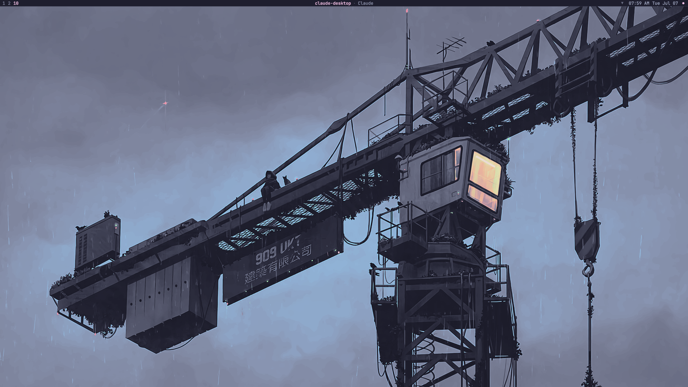
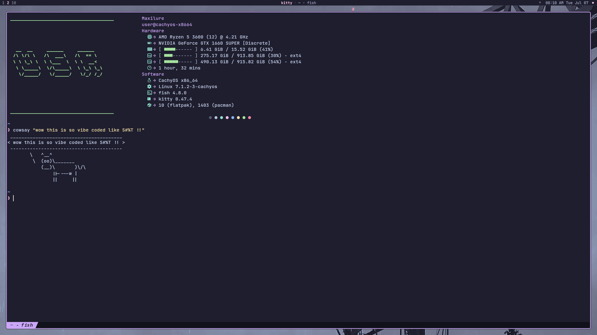

# Maxilure's Hyprland Rice

> **⚠️ Personal config — not intended for public use.**
> This is my personal dotfiles archive, shared as-is. The install script modifies packages, removes `paru`, overwrites config directories, and makes other changes specific to my setup. Review it before running. Use at your own risk.

> **🚧 Theme migration in progress.**
> This rice is moving away from Catppuccin Mocha to a Graphite dark aesthetic. Expect broad, breaking changes across configs and `install.sh` until this notice is removed. Checklist:
> - [x] Quickshell colors (`Colors.js` → Graphite dark palette)
> - [x] GTK3/4 theme → Adwaita-dark (system default)
> - [x] Cursor theme → WhiteSur cursors
> - [x] Kvantum theme → KvFlat
> - [ ] SDDM theme
> - [x] Kitty color scheme
> - [x] Rofi color scheme (`rofi/config.rasi`)
> - [x] `hypr/env.lua` cursor/GTK theme env vars
> - [x] `install.sh` package list
> - [ ] Bundled wallpapers (currently from [orangci/walls-catppuccin-mocha](https://github.com/orangci/walls-catppuccin-mocha))
> - [ ] README wording/screenshots below

A personally curated [Hyprland](https://hyprland.org/) dotfiles setup with a clean, functional workflow.

## Showcase






## What's Included

| Component | Role |
|---|---|
| [Kitty](https://sw.kovidgoyal.net/kitty/) | Terminal emulator |
| [Fastfetch](https://github.com/fastfetch-cli/fastfetch) | System info fetch |
| [Rofi](https://github.com/davatorium/rofi) | App launcher, emoji picker, clipboard picker |
| [Quickshell](https://quickshell.outfoxxed.me/) | Top bar, widgets, tray, notifications |
| [Tint](https://github.com/Maxilure/Maxilure-Hyprland-Rice/tree/main/tint) | Wallpaper randomizer using `awww` |
| [Hypralt](https://github.com/Maxilure/Maxilure-Hyprland-Rice/tree/main/scripts) | `ALT + TAB` window switcher (Python) |
| SDDM Theme | [where-is-my-sddm-theme](https://github.com/stepanzubkov/where-is-my-sddm-theme) (classic, no cursor) |
| GTK/Cursor | Adwaita-dark + WhiteSur cursors |
| Kvantum | KvFlat |
| Wallpapers | Bundled (curated from [orangci/walls-catppuccin-mocha](https://github.com/orangci/walls-catppuccin-mocha)) |

## Keybinds

| Key | Action |
|---|---|
| `SUPER + Return` | Open terminal (Kitty) |
| `SUPER + Space` | Open app launcher (Rofi) |
| `SUPER + .` | Open emoji picker (RofiMoji) |
| `SUPER + V` | Open clipboard picker (Rofi + cliphist) |
| `SUPER + W` | Random wallpaper (Tint) |
| `ALT + TAB` | Window switcher (Hypralt) |
| `SUPER + Q` | Kill focused window |
| `SUPER + F` | Toggle window float |
| `SUPER + ALT + F` | Toggle fullscreen |
| `Print` | Screenshot (area → clipboard + Swappy) |
| `SUPER + Escape` | Kill stuck screenshot processes |

See [binds.lua](hypr/binds.lua) for the full list.

## Installation

> **Requires:** Arch Linux or CachyOS

```bash
git clone https://github.com/Maxilure/Maxilure-Hyprland-Rice.git
cd Maxilure-Hyprland-Rice
./install.sh
```

What the script does:
1. Detects your distro (CachyOS / Arch), installs `yay`, removes `paru` if found
2. Installs all required packages (skips already-installed ones)
3. Backs up any existing configs in `~/.config/`
4. Deploys all configs to `~/.config/{kitty,fastfetch,rofi,quickshell,hypr}`
5. Installs `hypralt` to `~/.local/bin/` and `tint` to `/usr/local/bin/`
6. Copies bundled wallpapers to `~/Pictures/Wallpapers/`
7. Applies Adwaita-dark GTK theme + WhiteSur cursor, KvFlat Kvantum theme, where-is-my-sddm-theme (classic, no cursor)

After install, log out and back in, or restart SDDM / Hyprland.

Before using, add your monitors in `~/.config/hypr/monitors.lua` (it comes with a template).

### Post-install

- **Tint:** Run `tint set-folder ~/Pictures/Wallpapers` to set up the wallpaper folder

## Usage

### Tint (wallpapers)

Tint is a wallpaper randomizer built on top of `awww`. First-time setup:

```bash
tint set-folder ~/Pictures/Wallpapers   # point it at your wallpaper folder
tint random                              # apply a random one immediately
```

`SUPER + W` triggers a random wallpaper at any time. Tint picks per-monitor automatically if multiple monitors are connected.

### Clipboard picker (`SUPER + V`)

The clipboard picker requires `cliphist` to be running in the background, which the startup config handles automatically via `startup.lua`. If it's not working:

1. Check it's running: `pgrep cliphist`
2. If not, start it manually: `wl-paste --type text --watch cliphist store &`
3. Copy something, then try `SUPER + V` again

Paste behavior is terminal-aware — terminals get `Ctrl+Shift+V`, everything else gets `Ctrl+V`.

### Emoji picker (`SUPER + .`)

Loops so you can insert multiple emojis in a row. Press `Escape` to close.

### Quickshell (bar & widgets)

The bar targets the screen named in `~/.config/quickshell/settings.json` (`barScreen`). If that monitor isn't connected, it automatically falls back to all available screens — no config change needed.

**Notifications:** Quickshell acts as its own notification server. Do **not** run `dunst`, `mako`, or `swaync` alongside it — they'll conflict on the D-Bus notification seat and one will silently win.

To change which screen the bar appears on, edit `settings.json`:

```json
"barScreen": "DP-3"
```

Use `hyprctl monitors` to list your screen names.

### Hypralt (`ALT + TAB`)

Python-based window switcher. Cycles through windows on the focused monitor. If it stops responding, kill the stuck process:

```bash
pkill -f hypralt
```

### Screenshots (`Print`)

Draws a selection box, copies to clipboard, and opens Swappy for annotation. `SUPER + Escape` kills any stuck `grim`/`slurp` process if a screenshot gets frozen mid-selection.

## Troubleshooting

**Bar not showing after install**
Run `quickshell` from a terminal and check for errors. Make sure no other shell (AGS, waybar, etc.) is running on the same screen.

**Notifications not appearing**
Make sure `dunst`, `mako`, or `swaync` are not running — they block Quickshell from claiming the notification D-Bus seat. Stop them with `pkill dunst` (or equivalent) and reload Hyprland.

**Clipboard picker shows nothing**
`cliphist` only stores entries that were copied *after* it started. Copy something first, then try `SUPER + V`. If it still doesn't work, check `startup.lua` has the `wl-paste --watch cliphist store` lines and restart Hyprland.

**Tint: "No wallpaper folder set"**
Run `tint set-folder ~/Pictures/Wallpapers` once to initialise the config.

**Qt apps (Dolphin, etc.) not themed**
The install script sets KvFlat automatically via `kvantummanager`. If it didn't apply, run `kvantummanager --set KvFlat` manually.

**Cursor wrong in some apps**
Make sure `XCURSOR_THEME` and `XCURSOR_SIZE` are set in `~/.config/hypr/env.lua` (they are by default). If a specific app still shows the wrong cursor, set `WLR_NO_HARDWARE_CURSORS=1` in env.lua as a workaround.

**`hypralt` not in PATH after install**
The script installs it to `~/.local/bin/`. Make sure that's in your `PATH`:
```bash
echo 'export PATH="$HOME/.local/bin:$PATH"' >> ~/.bashrc
```

## Theme

This rice uses a **Graphite dark** aesthetic — a monochrome, low-contrast dark palette with neutral grays and subtle accents. GTK apps use Adwaita-dark, Qt apps use KvFlat.

## Credits

- [Hyprland](https://hyprland.org/) — the Wayland compositor
- [Quickshell](https://quickshell.outfoxxed.me/) — widget system (bar, tray, notifications)
- [awww](https://codeberg.org/LGFae/awww) — wallpaper daemon
- [orangci/walls-catppuccin-mocha](https://github.com/orangci/walls-catppuccin-mocha) — current wallpaper source (pending replacement)
